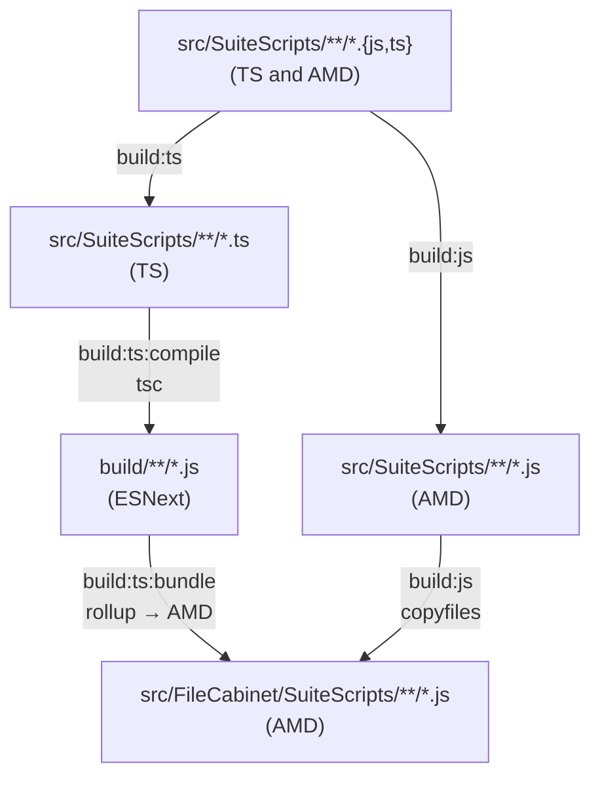

# suitecloud-ts

Scaffolding for using TypeScript v7+ in SuiteCloud Account Customization Projects (ACP).

Additionally, this project demonstrates **Option 3** of the folder structure alternatives
proposed in [oracle/netsuite-suitecloud-sdk#976](https://github.com/oracle/netsuite-suitecloud-sdk/issues/976).

## Folder Structure

```text
/
├ .github/workflows       # github actions
├ __tests__/              # jest tests
├ lib/                    # entry points for Zod and other 3rd-party libs for bundling
├ src/                    # folder used as `defaultProjectFolder` in suitecloud.config.js
│ ├ FileCabinet/          # standard folder expected by the SuiteCloud CLI
│ │ └ ...                 # folders expected by the SuiteCloud CLI except SuiteScripts (i.e. Templates)
│ ├ Objects/              # SuiteCloud XML objects
│ ├ SuiteScripts/         # TS and JS source files, not deployed to NetSuite
│ ├ deploy.xml
│ └ manifest.xml
└ ...                     # project, build, bundle and SuiteCloud configuration files
```

TypeScript source files sit inside `defaultProjectFolder` (i.e. `src/`) but outside `FileCabinet/`.
The TypeScript compiler outputs compiled JS directly into `src/FileCabinet/SuiteScripts/`, which is
what gets deployed to the File Cabinet, and is ignored from Git.

## Features

### Main features

- TypeScript and JavaScript files are compiled into the native `FileCabinet` folder
  expected by the CLI
- TypeScript and JavaScript source co-exist in the same directory
- No need to customize `object:import` when downloading files
- TypeScript files won't be deployed to the File Cabinet
- Compiled JavaScript files are ignored from Git
- Developer is warned whenever a file may be downloaded/created in the ignored folder
- Allows incremental adoption of TypeScript into existing JavaScript projects by
  supporting import of JavaScript files from TypeScript
- Includes NetSuite types via 3rd-party [`@hitc/netsuite-types`](https://www.npmjs.com/package/@hitc/netsuite-types) package
- TypeScript v7 for better performance and future support
- Support bundling third-party libraries into SuiteScript-compatible AMD modules

### Quality-of-life features

- ESLint with TypeScript support and `requirejs` rules for plain JavaScript files
- Prettier formatting
- Includes GitHub Action for PR validation
- Pre-commit hooks for linting, format and conventional commit message
- NVM support via `.nvmrc` file
- Nix flake configuration with `direnv` support for dev shell

## Setup

1. (Optional) If using `nix` and `direnv`, make sure flakes are enabled, and run:

    ```bash
    direnv allow
    ```

2. If not using `nix`, make sure the `suitecloud-cli` [package](https://www.npmjs.com/package/@oracle/suitecloud-cli)
   is installed globally.

3. Install dependencies using `npm`:

    ```bash
    npm install
    ```

## Usage

Run deployments and other SuiteCloud CLI commands as usual. The build runs
automatically before each command.

```bash
suitecloud project:deploy
```

## Scripts

| Script                            | Description                                               |
| --------------------------------- | --------------------------------------------------------- |
| `npm run build`                   | Compile TypeScript and copy static files to `FileCabinet` |
| `npm run bundle:lib`              | Bundle third-party libraries into `src/SuiteScripts/lib/` |
| `npm run clean`                   | Remove compiled output from `FileCabinet/SuiteScripts`    |
| `npm run lint` / `lint:fix`       | Lint the project or auto-fix linting issues               |
| `npm run format` / `format:check` | Format or check format with Prettier                      |
| `npm test`                        | Run unit tests with Jest                                  |

## SuiteCloud CLI Hooks

`suitecloud.config.js` hooks into several SuiteCloud CLI commands via `beforeExecuting` to automate
the build and keep the developer experience consistent:

| Command            | Hook behavior                            |
| ------------------ | ---------------------------------------- |
| `project:deploy`   | Runs build and tests                     |
| `project:validate` | Runs build                               |
| `project:package`  | Runs build                               |
| `file:upload`      | Runs build                               |
| `file:create`      | Prints a note to move generated JS files |
| `file:import`      | Prints a note to move generated JS files |
| `object:import`    | Prints a note to move generated JS files |
| `object:update`    | Prints a note to move generated JS files |

Commands that write files into `FileCabinet` (`file:create`, `file:import`, `object:import`, `object:update`)
print a reminder to move any downloaded JS files into `src/SuiteScripts/` so they are managed by the
build pipeline rather overritten by the next build.

## Build Pipeline

SuiteScript files must be delivered as AMD modules, but [TypeScript 7 dropped the
`module: "amd"` compiler option](https://devblogs.microsoft.com/typescript/announcing-typescript-7-0/#updates-since-5.x-and-new-behaviors-from-6.0).
The pipeline works around this by having `tsc` emit ESNext modules into an intermediate
`build/` directory, then passing that output through Rollup to produce the AMD bundles
that NetSuite expects.

The `npm run build` command runs `build:ts` and `build:js` concurrently. `build:ts`
chains two sequential steps; `build:js` runs independently in parallel:



### `build:ts:compile` - TypeScript compilation

TypeScript 7 compiles `src/SuiteScripts/**/*.ts` into `build/` using `tsconfig.build.json`.
The output format is ESNext with ES modules (`module: "esnext"`), producing clean
intermediate JS before any bundling. NetSuite's `N/*` module paths are left as bare imports at this stage.

> **Note:** TypeScript 7 is installed as `typescript7` (aliased from `npm:typescript@^7`) to
> avoid conflicting with the `typescript` package, which remains at v6 so that
> `typescript-eslint` (which does not yet support TypeScript 7) continues to work.

### `build:ts:bundle` - Rollup bundling

Runs after `build:ts:compile`. Rollup picks up every file in `build/` and outputs
AMD modules into `src/FileCabinet/SuiteScripts/`, preserving the original module
structure. Several inline plugins handle NetSuite-specific concerns:

- Mark all `N/*` imports as external so Rollup does not attempt to bundle them.
- Rewrite `import * as x from 'N/...'` to `import x from 'N/...'` so Rollup can emit clean
  AMD dependencies without interop boilerplate.
- Mark relative imports that resolve to plain JS AMD files (not compiled by tsc) as external
  so they are not inlined.Tthose files are handled by the static copy step instead.
- Moves `@NApiVersion`/`@NScriptType` JSDoc comments back to the top of each file,
  because Rollup's AMD wrapper would place them inside `define()`.

### `build:js` - Static JS copy

Runs concurrently with `build:ts`. Plain JavaScript files under `src/SuiteScripts/`
(existing AMD scripts not managed by tsc) are copied directly into `src/FileCabinet/SuiteScripts/`
with `copyfiles`.

## Library Bundler

Third-party npm packages cannot be loaded directly in SuiteScript, since it expects AMD modules
served from the File Cabinet. The library bundler pre-bundles selected packages into self-contained
AMD files that can be uploaded and imported like any other SuiteScript file.

### How it works

Each library gets a small entrypoint in `lib/` that re-exports the public API, for example:

```ts
// lib/zod.ts
export { z as default } from 'zod';
```

Running `npm run bundle:lib` processes every entrypoint in `lib/` through Rollup
(`rollup.config.lib.mjs`) and writes two output files per library into `src/SuiteScripts/lib/`:

- **`<package>.js`** — the full library bundled as an AMD module, ready for the File Cabinet
- **`<package>.d.ts`** — bundled type declarations for use during TypeScript development

Both output files should be committed to the repository. They are consumed directly by the TypeScript
build pipeline, and no build step is required for day-to-day development after the initial bundle.

### Bundling a new library

1. Install the package as a dev dependency:

    ```bash
    npm install --save-dev <package>
    ```

2. Create an entrypoint in `lib/` that exports the API your scripts will use, for example:

    ```ts
    // lib/<package>.ts
    export { something as default } from '<package>';
    ```

3. Add two entries to the `export default` array in `rollup.config.lib.mjs`: one for the JS
   bundle and one for the type declarations:

    ```js
    // JS bundle
    {
      input: `${dirs.entrypoints}/<package>.ts`,
      output: { file: `${dirs.output}/<package>.js`, format: 'amd' },
      plugins: [resolve()],
    },
    // Type declarations
    {
      input: `${dirs.entrypoints}/<package>.ts`,
      output: { file: `${dirs.output}/<package>.d.ts`, format: 'es' },
      plugins: [resolve(), dts({ respectExternal: true })],
    },
    ```

4. Run the bundler and commit the output:

    ```bash
    npm run bundle:lib
    git add src/SuiteScripts/lib/<package>.js src/SuiteScripts/lib/<package>.d.ts
    ```

5. In your SuiteScript files, import the bundled library using its relative path:

    ```ts
    import name from './lib/<package>';
    ```
