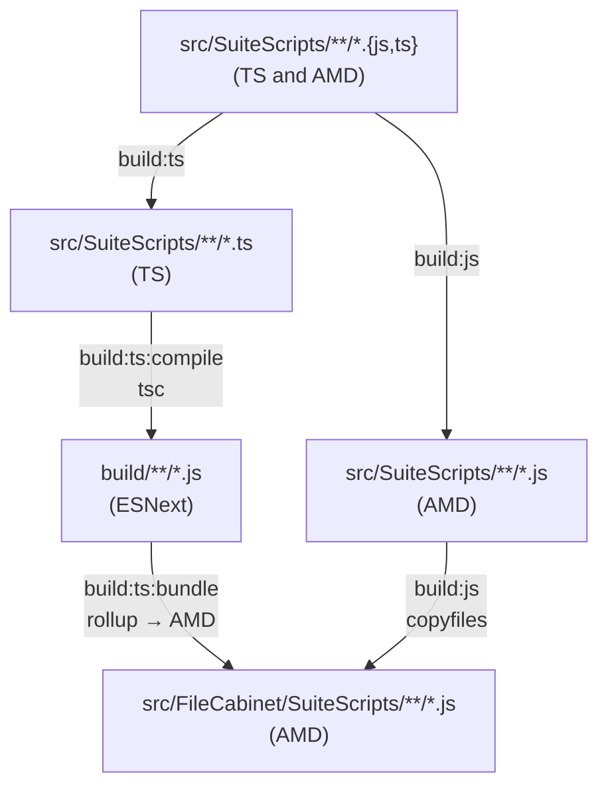

# suitecloud-ts

Sample scaffolding for using TypeScript in NetSuite SuiteCloud Account Customization Projects (ACP).

This project demonstrates **Option 3** of the folder structure alternatives proposed in [oracle/netsuite-suitecloud-sdk#976](https://github.com/oracle/netsuite-suitecloud-sdk/issues/976):

> Use TS files inside `defaultProjectFolder` but outside the `FileCabinet` folder, `tsc` builds into `FileCabinet`.

## Folder Structure

```text
src/                    # folder used as `defaultProjectFolder` in suitecloud.config.js
  FileCabinet/          # standard folder expected by the SuiteCloud CLI
    SuiteScripts/       # TS output folder, ignored from Git, deployed to NetSuite
    ...                 # other folders expected by the SuiteCloud CLI (i.e. Templates)
  SuiteScripts/         # TS and JS source files, not deployed to NetSuite
  Objects/              # SuiteCloud XML objects
  deploy.xml
  manifest.xml
```

TypeScript source files sit inside `defaultProjectFolder` (i.e. `src/`) but outside `FileCabinet/`.
The TypeScript compiler outputs compiled JS directly into `src/FileCabinet/SuiteScripts/`, which is
what gets deployed to the File Cabinet, and is ignored from Git.

## Features

### Main features

- TypeScript and JavaScript files are compiled into the native `FileCabinet` folder
  expected by the CLI
- TypeScript and JavaScript source co-exist in the same directory
- No need to customize `object:import` when downloading files
- TypeScript files won't be deployed to the File Cabinet
- Compiled JavaScript files are ignored from Git
- Developer is warned whenever a file may be downloaded/created in the ignored folder
- Allows incremental adoption of TypeScript into existing JavaScript projects by
  supporting import of JavaScript files from TypeScript
- Includes NetSuite types via 3rd-party [`@hitc/netsuite-types`](https://www.npmjs.com/package/@hitc/netsuite-types) package
- TypeScript v7 for better performance and future support
- (TODO) Support bundling third party libraries into SuitScript compatible source

### Quality-of-life features

- ESLint with TypeScript support and `requirejs` rules for plain JavaScript files
- Prettier formatting
- Includes GitHub Action for PR validation
- Pre-commit hooks for linting, format and conventional commit message
- NVM support via `.nvmrc` file
- Nix flake configuration with `direnv` support for dev shell

## Setup

Install dependencies:

```bash
npm install
```

## Scripts

| Script                            | Description                                               |
| --------------------------------- | --------------------------------------------------------- |
| `npm run build`                   | Compile TypeScript and copy static files to `FileCabinet` |
| `npm run clean`                   | Remove compiled output from `FileCabinet/SuiteScripts`    |
| `npm run lint` / `lint:fix`       | Lint the project or auto-fix linting issues               |
| `npm run format` / `format:check` | Format or check format with Prettier                      |
| `npm test`                        | Run unit tests with Jest                                  |

## Build Pipeline

The `npm run build` command runs `build:ts` and `build:js` concurrently. `build:ts`
chains two sequential steps; `build:js` runs independently in parallel:



### `build:ts:compile` - TypeScript compilation

TypeScript 7 compiles `src/SuiteScripts/**/*.ts` into `build/` using `tsconfig.build.json`.
The output format is ESNext with ES modules (`module: "esnext"`), producing clean
intermediate JS before any bundling. NetSuite's `N/*` module paths are left as bare imports at this stage.

### `build:ts:bundle` - Rollup bundling

Runs after `build:ts:compile`. Rollup picks up every file in `build/` and outputs
AMD modules into `src/FileCabinet/SuiteScripts/`, preserving the original module
structure. Several inline plugins handle NetSuite-specific concerns:

- Mark all `N/*` imports as external so Rollup does not attempt to bundle them.
- Rewrite `import * as x from 'N/...'` to `import x from 'N/...'` so Rollup can emit clean
  AMD dependencies without interop boilerplate.
- Mark relative imports that resolve to plain JS AMD files (not compiled by tsc) as external
  so they are not inlined.Tthose files are handled by the static copy step instead.
- Moves `@NApiVersion`/`@NScriptType` JSDoc comments back to the top of each file,
  because Rollup's AMD wrapper would place them inside `define()`.

### `build:js` - Static JS copy

Runs concurrently with `build:ts`. Plain JavaScript files under `src/SuiteScripts/`
(existing AMD scripts not managed by tsc) are copied directly into `src/FileCabinet/SuiteScripts/`
with `copyfiles`.

## SuiteCloud CLI Build Hooks

`suitecloud.config.js` hooks into several SuiteCloud CLI commands via `beforeExecuting` to automate
the build and keep the developer experience consistent:

| Command            | Hook behavior                            |
| ------------------ | ---------------------------------------- |
| `project:deploy`   | Runs build and tests                     |
| `project:validate` | Runs build                               |
| `project:package`  | Runs build                               |
| `file:upload`      | Runs build                               |
| `file:create`      | Prints a note to move generated JS files |
| `file:import`      | Prints a note to move generated JS files |
| `object:import`    | Prints a note to move generated JS files |
| `object:update`    | Prints a note to move generated JS files |

Commands that write files into `FileCabinet` (`file:create`, `file:import`, `object:import`, `object:update`)
print a reminder to move any downloaded JS files into `src/SuiteScripts/` so they are managed by the
build pipeline rather overritten by the next build.

## Deployment

Run deployments and other SuiteCloud CLI commands as usual — the build runs automatically before each command:

```bash
suitecloud project:deploy
```
