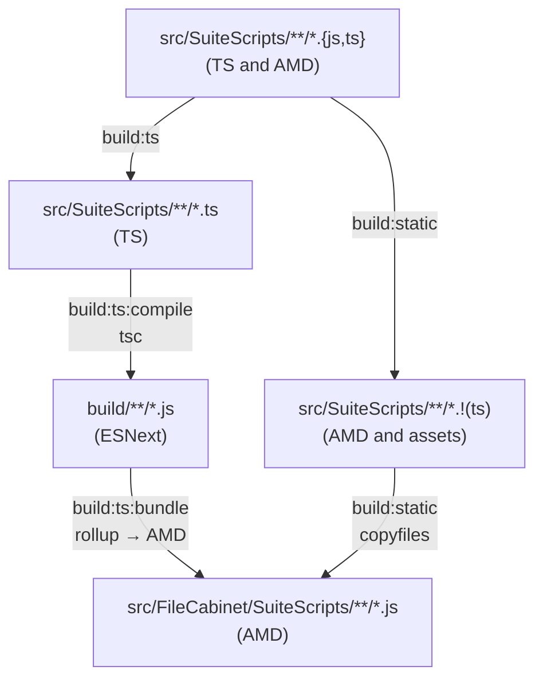

# Build Pipeline

SuiteScript files must be delivered as AMD modules, but [TypeScript 7 dropped the
`module: "amd"` compiler option](https://devblogs.microsoft.com/typescript/announcing-typescript-7-0/#updates-since-5.x-and-new-behaviors-from-6.0).
The pipeline works around this by having `tsc` emit ESNext modules into an intermediate
`build/` directory, then passing that output through Rollup to produce the AMD bundles
that NetSuite expects.

The `npm run build` command runs `build:ts` and `build:static` concurrently. `build:ts`
chains two sequential steps; `build:static` runs independently in parallel:

## `build:ts:compile` - TypeScript compilation

TypeScript 7 compiles `src/SuiteScripts/**/*.ts` into `build/` using `tsconfig.build.json`.
The output format is ESNext with ES modules (`module: "esnext"`), producing clean
intermediate JS before any bundling. NetSuite's `N/*` module paths are left as bare imports at this stage.

> **Note:** TypeScript 7 is installed as `typescript7` (aliased from `npm:typescript@^7`) to
> avoid conflicting with the `typescript` package, which remains at v6 so that
> `typescript-eslint` (which does not yet support TypeScript 7) continues to work.

## `build:ts:bundle` - Rollup bundling

Runs after `build:ts:compile`. Rollup picks up every file in `build/` and outputs
AMD modules into `src/FileCabinet/SuiteScripts/`, preserving the original module
structure. Several inline plugins handle NetSuite-specific concerns:

- Mark all `N/*` imports as external so Rollup does not attempt to bundle them.
- Rewrite `import * as x from 'N/...'` to `import x from 'N/...'` so Rollup can emit clean
  AMD dependencies without interop boilerplate.
- Mark relative imports that resolve to plain JS AMD files (not compiled by tsc) as external
  so they are not inlined. Those files are handled by the static copy step instead.
- Move `@NApiVersion`/`@NScriptType` JSDoc comments back to the top of each file,
  because Rollup's AMD wrapper would place them inside `define()`.

## `build:static` - Static file copy

Runs concurrently with `build:ts`. Every non-TypeScript file under `src/SuiteScripts/`
(existing AMD scripts not managed by tsc, plus any other assets such as HTML templates or JSON)
is copied directly into `src/FileCabinet/SuiteScripts/` with `copyfiles`.
